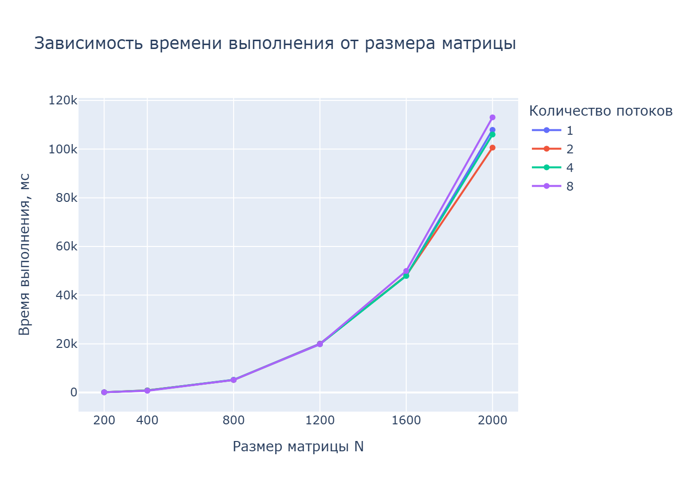

# Лабораторная работа №2

**Студент:** Колганова Елизавета Алексеевна

**Группа:** 6311-100503D

---

## 1 Цель работы

Модифицировать программу умножения квадратных матриц из лабораторной работы №1 для параллельного выполнения с использованием технологии OpenMP, измерить время выполнения программы при различных размерах матриц и различном количестве потоков, а также оценить влияние распараллеливания на производительность.

---

## 2. Теоретические сведения

Произведение двух квадратных матриц определяется по формуле:

$$C_{ij} = \sum_{k=1}^{n} A_{ik} \cdot B_{kj}$$

где:
- A — первая матрица
- B — вторая матрица
- C — результирующая матрица

При стандартном алгоритме перемножения квадратных матриц размером \(n \times n\):
- число умножений: $$(n^3)$$
- число сложений: $$(n^2 (n - 1))$$
- общее количество арифметических операций:

$$Operations = 2N^3$$

Алгоритмическая сложность программы:

$$O(N^3)$$

---

## 3. Описание алгоритма

1. Считать матрицу $A$ из файла `Mat_1.txt`
2. Считать матрицу $B$ из файла `Mat_2.txt`
3. Проверить совпадение размерностей
4. Создать результирующую матрицу $C$
5. Установить количество потоков OpenMP
6. Выполнить параллельное перемножение матриц
7. Измерить время выполнения
8. Сохранить результат в файл `Res.txt`
9. Вывести размер матрицы, количество потоков, время выполнения и количество операций

---


## 4. Исходный код программы

```cpp
#include <iostream>
#include <vector>
#include <fstream>
#include <iomanip>
#include <chrono>
#include <ctime>
#include <omp.h>

using namespace std;

void Write_Matrix(const string& str, size_t rows, size_t cols)
{
    vector<vector<int>> m(rows);
    for (auto& i : m)
        i.resize(cols);

    for (size_t i = 0; i < rows; i++) {
        for (size_t j = 0; j < cols; j++) {
            m[i][j] = rand() % 1000;
        }
    }

    ofstream data(str);
    if (!data.is_open()) {
        cerr << "Не удалось открыть файл для записи: " << str << endl;
        return;
    }

    for (size_t i = 0; i < rows; i++) {
        for (size_t j = 0; j < cols; j++) {
            data << setw(5) << m[i][j];
        }
        data << endl;
    }
    data.close();
}

void Read_Matrix(vector<vector<int>>& m, size_t rows, size_t cols, const string& str)
{
    m.resize(rows);
    for (auto& i : m)
        i.resize(cols);

    ifstream data(str);
    if (data.is_open()) {
        for (size_t i = 0; i < m.size(); i++) {
            for (size_t j = 0; j < m[i].size(); j++) {
                data >> m[i][j];
            }
        }
        data.close();
    } else {
        cerr << "Не удалось открыть файл для чтения: " << str << endl;
    }
}

void Multiplication_SEQ(const vector<vector<int>>& m_1,
                        const vector<vector<int>>& m_2,
                        vector<vector<int>>& m_3,
                        long long& ops)
{
    size_t rows  = m_1.size();
    size_t cols  = m_2[0].size();
    size_t inner = m_2.size();

    m_3.assign(rows, vector<int>(cols, 0));

    for (size_t i = 0; i < rows; i++) {
        for (size_t j = 0; j < cols; j++) {
            int sum = 0;
            for (size_t k = 0; k < inner; k++) {
                sum += m_1[i][k] * m_2[k][j];
                ops += 2; // умножение + сложение
            }
            m_3[i][j] = sum;
        }
    }
}

void Multiplication_OMP(const vector<vector<int>>& m_1,
                        const vector<vector<int>>& m_2,
                        vector<vector<int>>& m_3,
                        long long& ops,
                        int num_threads)
{
    size_t rows  = m_1.size();
    size_t cols  = m_2[0].size();
    size_t inner = m_2.size();

    m_3.assign(rows, vector<int>(cols, 0));

    long long ops_local = 0;

    omp_set_num_threads(num_threads);

    #pragma omp parallel for reduction(+:ops_local) schedule(static)
    for (int i = 0; i < static_cast<int>(rows); ++i) {
        for (size_t j = 0; j < cols; ++j) {
            int sum = 0;
            for (size_t k = 0; k < inner; ++k) {
                sum += m_1[i][k] * m_2[k][j];
                ops_local += 2; // умножение + сложение
            }
            m_3[i][j] = sum;
        }
    }

    ops += ops_local;
}

void Write_Res(const string& str, const vector<vector<int>>& res)
{
    ofstream data(str);
    if (!data.is_open()) {
        cerr << "Не удалось открыть файл для записи: " << str << endl;
        return;
    }

    for (size_t i = 0; i < res.size(); i++) {
        for (size_t j = 0; j < res[i].size(); j++) {
            data << setw(10) << res[i][j];
        }
        data << endl;
    }
    data.close();
}

int main()
{
    srand(static_cast<unsigned int>(time(nullptr)));

    // размеры матриц для экспериментов
    vector<int> sizes = {200, 400, 800, 1200, 1600, 2000};
    // набор потоков (можно ограничить по количеству ядер)
    vector<int> threads_list = {1, 2, 4, 8};

    int max_threads = omp_get_max_threads();
    cout << "Доступно потоков: " << max_threads << endl;

    // отфильтруем список потоков, чтобы не превышать доступное количество
    vector<int> threads;
    for (int t : threads_list) {
        if (t <= max_threads)
            threads.push_back(t);
    }
    if (threads.empty()) {
        threads.push_back(1);
    }

    ofstream stats("Stats_omp.txt");
    if (!stats.is_open()) {
        cerr << "Не удалось открыть Stats_omp.txt для записи" << endl;
        return 1;
    }

    stats << "N;threads;time_ms;ops" << endl;

    vector<vector<int>> v1, v2, v3;

    for (int n : sizes) {
        size_t row = n, col = n;

        cout << "=== N = " << n << " ===" << endl;

        // генерация и чтение матриц (один раз на каждый размер)
        Write_Matrix("Mat_1.txt", row, col);
        Write_Matrix("Mat_2.txt", row, col);

        Read_Matrix(v1, row, col, "Mat_1.txt");
        Read_Matrix(v2, row, col, "Mat_2.txt");

        for (int t : threads) {
            long long ops = 0;

            auto begin = chrono::steady_clock::now();
            Multiplication_OMP(v1, v2, v3, ops, t);
            auto end   = chrono::steady_clock::now();

            auto diff_ms = chrono::duration_cast<chrono::milliseconds>(end - begin).count();

            cout << "threads = " << t
                 << ", time(ms) = " << diff_ms
                 << ", ops = " << ops
                 << endl;

            stats << n << ';' << t << ';' << diff_ms << ';' << ops << endl;
        }

    
    }

    stats.close();

    return 0;
}
```
---

## 5 График зависимости времени




---

## 6 Анализ результатов

Для исследования зависимости времени выполнения от размера задачи программа запускалась на матрицах разных размеров.

В ходе экспериментов можно использовать размеры:

- 100x100
- 200x200
- 400x400
- 600х600
- 800x800
- 1200x1200
- 1600x1600
- 2000x2000

и число потоков в количестве:
- 1
- 2
- 4
- 8

По результатам экспериментов можно сделать следующие выводы:

- при увеличении размера матрицы время выполнения возрастает, что соответствует теоретической сложности $O(N^3)$;
- при увеличении количества потоков время выполнения уменьшается;
- наиболее заметный эффект распараллеливания проявляется на больших размерах матриц;
- на малых размерах матриц ускорение может быть незначительным из-за накладных расходов на организацию параллельного выполнения;
- увеличение числа потоков не всегда даёт линейный прирост производительности, так как эффективность ограничивается количеством ядер процессора, пропускной - способностью памяти и накладными расходами OpenMP.

---

## 7 Вывод

В ходе лабораторной работы была модифицирована программа последовательного умножения квадратных матриц для параллельного выполнения с использованием OpenMP. В программе реализовано управление количеством потоков, распараллелено выполнение основного вычислительного цикла и проведено исследование зависимости времени выполнения от размера задачи и параметров распараллеливания.

Результаты показывают, что применение OpenMP позволяет уменьшить время выполнения программы, особенно при работе с матрицами большого размера. Таким образом, технология OpenMP является удобным и эффективным средством распараллеливания вычислительно сложных задач.

---

